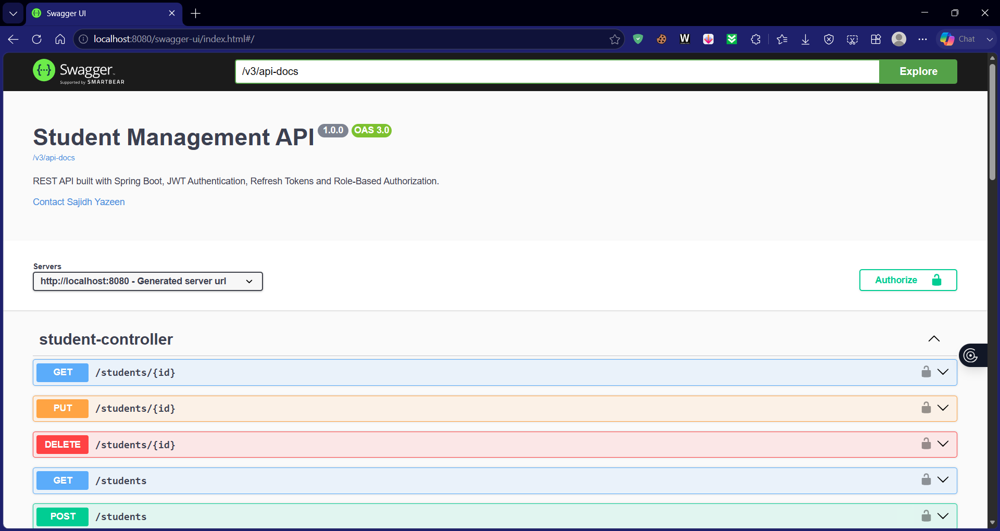
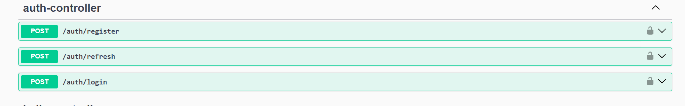
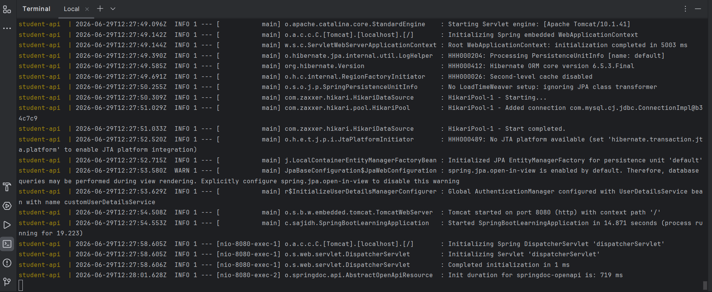
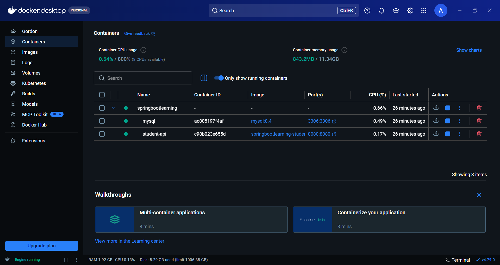
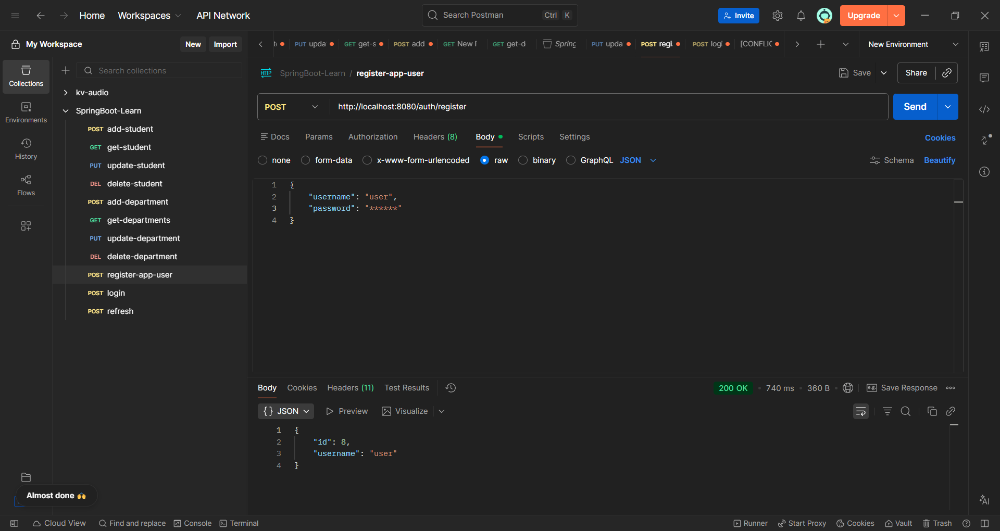
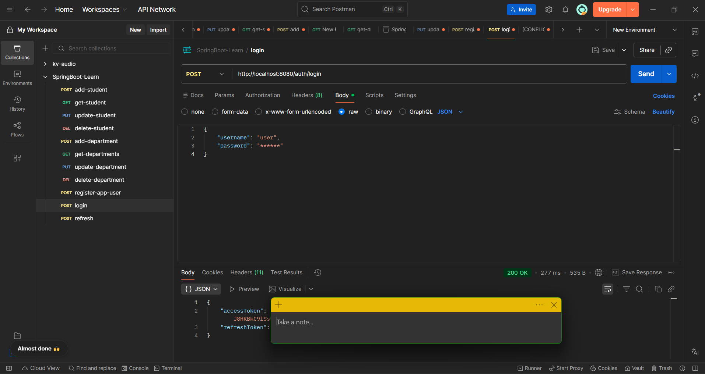
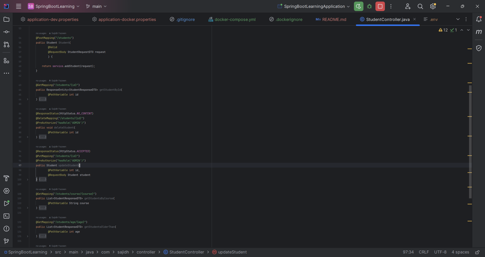

# Student Management REST API

A secure Student Management REST API built with Spring Boot.

The application provides CRUD operations for students and departments while implementing JWT authentication, refresh tokens, role-based authorization, validation, global exception handling, Docker containerization, and Swagger documentation.

The project demonstrates modern Spring Boot development practices suitable for learning and portfolio purposes.

## Features

- User Registration
- User Login
- JWT Authentication
- Refresh Token Authentication
- Role-Based Authorization (USER / ADMIN)
- Student CRUD Operations
- Department CRUD Operations
- Input Validation
- Global Exception Handling
- Swagger API Documentation
- Unit Testing
- Controller Testing
- Docker Support
- Docker Compose Support
- Spring Profiles


## Technologies

### Backend

- Java 21
- Spring Boot 3
- Spring Security
- Spring Data JPA
- Hibernate

### Database

- MySQL

### Authentication

- JWT
- Refresh Tokens

### Testing

- JUnit 5
- Mockito
- MockMvc

### Documentation

- Swagger / OpenAPI

### DevOps

- Docker
- Docker Compose

### Build Tool

- Maven


## Project Structure

src/main/java

├── config

├── controller

├── dto

├── exception

├── model

├── repository

├── security

├── service

└── SpringBootLearningApplication


## Running Locally

Clone the repository

```bash
git clone https://github.com/Agentz47/spring-boot-learning.git
```

Move into the project

```bash
cd SpringBootLearning
```

Create a MySQL database

```
student_managements
```

Run the application

```bash
./mvnw spring-boot:run
```


## Running with Docker

Build and start containers

```bash
docker compose up --build
```

Stop containers

```bash
docker compose down
```

## API Documentation

Swagger UI


http://localhost:8080/swagger-ui/index.html

OpenAPI JSON

http://localhost:8080/v3/api-docs


## Authentication Flow
Register

↓

Login

↓

Access Token + Refresh Token

↓

Access Protected APIs

↓

Access Token Expired

↓

Refresh Token

↓

New Access Token


## Security

The application uses JWT authentication.

Roles

- USER
- ADMIN

ADMIN users can perform privileged operations such as deleting records.

Access tokens are short-lived.

Refresh tokens are stored in the database and rotated after every refresh request.


## Testing

Run all tests

```bash
./mvnw test
```

## The project includes

- Unit Tests
- Controller Tests
- Mockito
- MockMvc


---

## Future Improvements

```
- Email Verification
- Password Reset
- Pagination
- Sorting
- Filtering
- Redis Cache
- GitHub Actions CI/CD
- Kubernetes Deployment
```
## Architecture Diagram
```
              Client
                 │
                 ▼
         Spring Boot API
                 │
      ┌──────────┴──────────┐
      ▼                     ▼
Spring Security       Swagger
│
▼
JWT Authentication
│
▼
Service Layer
│
▼
Repository Layer
│
▼
MySQL
```

## Screenshots














## Author

Sajidh Yazeen

Bachelor of Science (Hons) in Computer Science

Software Engineering